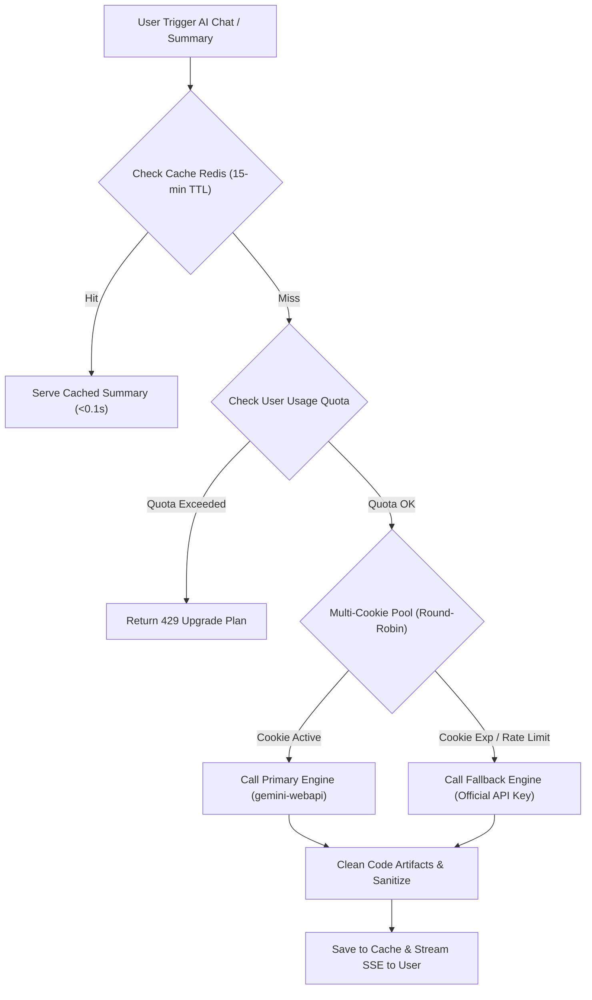

# Shiera AI Engine & Analytics Documentation (`ai.md`)

Dokumen ini berisi gambaran umum (*overview*), arsitektur teknis, panduan konfigurasi, dan roadmap pengembangan lanjutan untuk fitur kecerdasan buatan **Shiera AI Engine**.

---

## 🚀 1. Overview & Arsitektur Sistem

**Shiera AI Engine** adalah sistem kecerdasan buatan terintegrasi pada platform **Shiera Social Media Management** yang bertindak sebagai *Chief Marketing Officer (CMO) & Senior Analytics Specialist Virtual*.

### Fungsi Utama:
1. **Executive AI Summary**: Menganalisis metrik sosial media (Likes, Comments, Shares, Reach, Video Views, Engagement Rate) dari akun terhubung dan menghasilkan laporan analisis eksekutif secara otomatis.
2. **Interactive AI Chat Drawer**: Memungkinkan pengguna melakukan diskusi interaktif lanjutan (*follow-up chat*) seperti meminta ide caption, analisis mendalam postingan tertentu, atau strategi konten mingguan.
3. **White-Label White-Box Engine**: Menggunakan identitas 100% pure brand **Shiera AI Engine** tanpa memunculkan emblem pihak ketiga.

---

## 🛠️ 2. Komponen Teknis Terimplementasi

### A. Dual Engine, Fallback & Automated WhatsApp Alert System (`backend/services/gemini_service.py` & `backend/services/fonnte_service.py`)
- **Primary Engine**: `gemini-webapi` menggunakan Session Cookie Admin (`__Secure-1PSID` & `__Secure-1PSIDTS`).
- **Fallback Engine**: Official `google-generativeai` menggunakan API Key.
- **Auto-Failover**: Jika Session Cookie mengalami *rate limit* atau kadaluarsa, backend secara transparan mengalihkan pemrosesan ke Official API Key tanpa menghentikan pengalaman pengguna.
- **Automated Owner WhatsApp Alert (Fonnte Integration)**:
  - Jika Session Cookie terdeteksi tidak valid / exp (saat test koneksi atau request AI), Fonnte API secara otomatis mengirimkan pesan peringatan WhatsApp ke nomor **Owner (`082125182347`)**.
  - Dilengkapi sistem *cooldown timer* (30 menit) untuk mencegah spam notifikasi ke nomor WhatsApp owner.
- **Code Interpreter Sanitizer**: Backend & Frontend dilengkapi sanitizer regex `_clean_code_interpreter_artifacts` yang membersihkan blok kode Python internal (`python?codereference` & `text?codestdout`) sehingga output yang diterima user 100% narasi Bahasa Indonesia murni.

### B. Admin Control Panel Configuration (`backend/routers/admin.py` & `frontend/src/app/admin/page.tsx`)
- Terletak pada tab **App Settings & API Keys** di `/admin`.
- Kunci Konfigurasi:
  - `GEMINI_1PSID` / `__Secure-1PSID`: Session Cookie Utama.
  - `GEMINI_1PSIDTS` / `__Secure-1PSIDTS`: Session Cookie TS.
  - `GEMINI_API_KEY`: API Key cadangan.
- Dilengkapi tombol **"Test Koneksi Shiera AI"** (`POST /admin/test-gemini`) untuk menguji keaktifan koneksi secara real-time.

### C. Clean Markdown Renderer (`frontend/src/components/common/ShieraMarkdownViewer.tsx`)
- Komponen pembaca Markdown khusus yang mengonversi teks laporan AI menjadi HTML visual bersih:
  - Heading (`## `, `### `) &rarr; Judul bab terstruktur.
  - Tabel Markdown (`| Platform | Reach |`) &rarr; Elemen `<table>` visual tanpa karakter pipa mentah.
  - Poin List (`* `, `- `) &rarr; Elemen list `<ul><li>` bergaya bullet.
  - Callout (`> `) &rarr; Quote box berwarna ungu lembut.

### D. Global Chat Drawer & Floating Minimize Widget (`frontend/src/components/common/ShieraAiReportWidget.tsx` & `frontend/src/store/useAiReportStore.ts`)
- Pengelolaan state global via Zustand (`useAiReportStore.ts`).
- Fitur **Minimize**: Pengguna dapat meminimalkan popup chat menjadi **Floating AI Badge** melayang di sudut kanan bawah layar.
- **Cross-Page Persistence**: Floating badge tetap aktif dan dapat dibuka kembali (*restore*) meskipun pengguna berpindah ke halaman lain (Dashboard, Calendar, Posts, Media, dll.).
- **Interactive Follow-up Thread**: Pengguna dapat mengetikkan pertanyaan lanjutan langsung pada kolom chat bagian bawah.

### E. Date Range Filter Optimization (`frontend/src/app/statistics/page.tsx`)
- Pemilihan pill **"Custom"** pada filter tanggal **TIDAK memicu request otomatis ke server**.
- Pilihan "Custom" hanya memunculkan input tanggal (*Date From* & *Date To*).
- Request fetch data baru berjalan efisien saat pengguna menekan tombol **"Tampilkan"** / **"Terapkan Filter"** atau memilih pill preset (Today, 7 Days, 30 Days).

---

## 🔮 3. Roadmap Optimalisasi Skala Besar (Production Scale)

Untuk mendukung penggunaan bersamaan oleh ribuan user (*high concurrency*) secara stabil dan bebas crash, berikut alur pengembangan tahap berikutnya:

### Plan Pengembangan Lanjutan:
1. **Multi-Cookie Session Pool**:
   - Menambahkan array cookie di database (`GEMINI_COOKIES_1`, `GEMINI_COOKIES_2`, dst.).
   - Rotasi otomatis secara *Round-Robin* untuk membagi beban request simultan.
2. **Quota Limiter per Subscription Plan**:
   - Membatasi jumlah generasi AI Chat harian berdasarkan tier langganan pengguna (Creator, Agency, Studio).
3. **Response Streaming via SSE (Server-Sent Events)**:
   - Mengubah endpoint dari JSON sekali kirim menjadi streaming teks per kata (*typing effect*), mencegah Vercel gateway timeout (504).

---

## 📌 4. Ringkasan File Terkait

| Nama File | Path | Deskripsi Utama |
| :--- | :--- | :--- |
| `gemini_service.py` | `backend/services/gemini_service.py` | Core AI service, prompt CMO, dual engine adapter & artifact cleaner. |
| `statistics.py` | `backend/routers/statistics.py` | Endpoint `POST /statistics/ai-summary` (dukungan overview & follow-up chat). |
| `admin.py` | `backend/routers/admin.py` | Endpoint `POST /admin/test-gemini` & manajemen settings. |
| `useAiReportStore.ts` | `frontend/src/store/useAiReportStore.ts` | Zustand store untuk state floating widget & riwayat percakapan. |
| `ShieraAiReportWidget.tsx` | `frontend/src/components/common/ShieraAiReportWidget.tsx` | Interactive Chat Drawer UI & Floating Minimized Widget. |
| `ShieraMarkdownViewer.tsx` | `frontend/src/components/common/ShieraMarkdownViewer.tsx` | Parser HTML bersih untuk Markdown tanpa kode mentah. |
| `page.tsx` (Admin) | `frontend/src/app/admin/page.tsx` | Form konfigurasi Session Cookie & tombol test koneksi. |
| `page.tsx` (Stats) | `frontend/src/app/statistics/page.tsx` | Tombol Shiera AI Summary & optimalisasi filter tanggal. |

---
*Dokumen ini dibuat otomatis sebagai panduan kelanjutan arsitektur Shiera AI Engine.*
